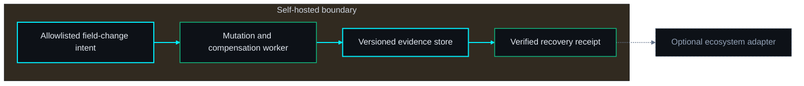
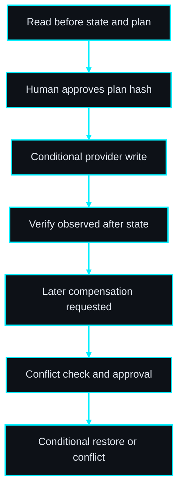
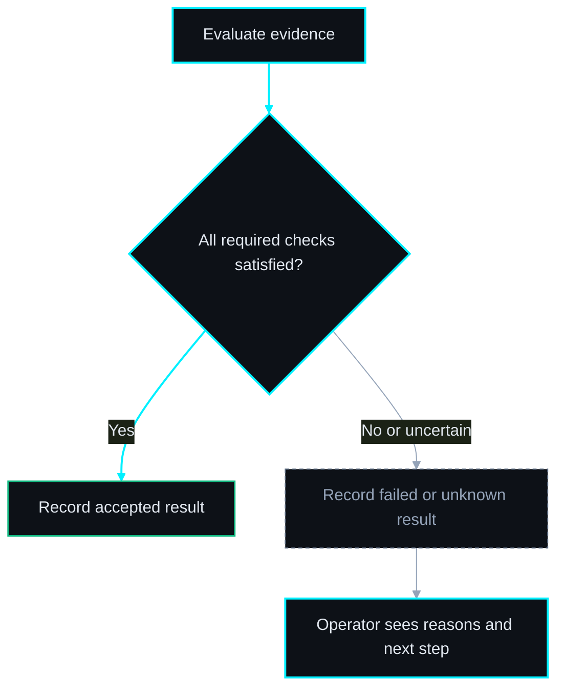

# PRD: UndoKit

**Recover an approved CRM field change without overwriting later work.**

Author: Codex via prd-writer · 2026-09-29

Status: Draft; proposed topology; open-source direction; implementation not started. Board: #3793 (authoring only).

## 1. Problem Statement

An automation updates the wrong fields and recovery requires guessing previous values. A naive rollback then overwrites legitimate edits made after the incident.

**Primary user / buyer:** Agencies and operations teams using automation to update CRM records.

**Evidence status:** product hypothesis from ecosystem operational pain, not validated demand. No competitor absence or willingness-to-pay claim is made. Before building beyond a synthetic prototype, interview three prospective users, capture five recent examples and compare the proposed workflow with their current tools.

## 2. Goal

Wrap a small allowlist of CRM field updates in durable before/after receipts and provide human-approved, conflict-aware compensation.

**Position in the ecosystem:** RunProof can link the execution receipt. UndoKit owns only its instrumented field mutations and their compensation; historical uninstrumented actions cannot be reconstructed.

**Open-source boundary:** the complete deterministic MVP, schemas, synthetic examples, test harness and operational documentation belong in the public source release. Self-hosting must not require a license server or private fleet service. Hosted operation/support is a possible later business model; willingness to pay must be tested. License and product-name clearance remain owner decisions before publication.

## 3. Non-Goals

Undoing emails, payments, deletion or arbitrary workflows; automatic rollback; global atomic transactions across providers; claiming exactly-once external writes without provider support.

No sibling product is a mandatory runtime dependency. No repository creation, implementation dispatch, production mutation, merge or deployment is authorized by this PRD authoring task. AI-generated prose cannot substitute for test evidence or operator approval.

## 4. Success Metrics

| Metric | Baseline collection | Pilot target | Evidence |
| --- | --- | --- | --- |
| Baseline completion | Before first pilot: time five current manual workflows and record errors | Five usable baseline records per pilot team | Dated operator worksheet |
| Operator recovery time for an instrumented wrong-field update | Use the same scenario class and record sample size | Median under five minutes in 10 sandbox drills; zero intervening edits overwritten | Raw timestamps and outcome receipts |
| Activation | Record starting user count in the pilot | Three teams complete a synthetic core workflow within 30 minutes of install | Opt-in operator reports |
| Retention / value | Ask whether current workflow is still used after four weeks | Two of three teams elect to continue using the tool | Interview with concrete saved-time examples |

Targets are proposed decision thresholds. Report failures and sample sizes; small pilots do not establish market demand. Stop expansion if the baseline shows no recurring pain or existing tools solve it sufficiently.

## 5. Acceptance Criteria

- [ ] **AC-01** — Allow only configured scalar CRM fields; reject deletion, sends, unknown fields and records outside connector scope before any write.
- [ ] **AC-02** — Persist before state and approved plan hash before dispatch; changed intent or expired approval invalidates authorization.
- [ ] **AC-03** — Use provider conditional writes; concurrent record modification returns CONFLICT without overwriting external changes.
- [ ] **AC-04** — Crash after remote success but before local receipt yields UNKNOWN and read-only reconciliation; retries never blindly repeat the mutation.
- [ ] **AC-05** — Compensation previews exact fields and requires separate approval; changed current values or versions block compensation.
- [ ] **AC-06** — Duplicate idempotency key and identical intent returns one operation; changed intent with same key returns 409.
- [ ] **AC-07** — A live sandbox drill changes an allowlisted field and restores its original value; a planted intervening edit remains untouched.
- [ ] **AC-08** — A synthetic demo works without paid accounts or mandatory telemetry; an outbound-denied test completes the deterministic local core. Live connector operations fail explicitly when disconnected.
- [ ] **AC-09** — Validate size and schema before processing; planted secret tokens never appear in logs or exported reports; malicious HTML renders as text.
- [ ] **AC-10** — Export a versioned evidence bundle and restore/read it in a clean installation with matching hashes; truncated or unsupported exports fail without partial accepted state.
- [ ] **AC-11** — Release documentation includes installation, upgrade, backup, restore and failure diagnosis; a fresh operator can execute the synthetic smoke procedure.
- [ ] **AC-12** — Enforce workspace membership and admin/operator/viewer roles on reads, writes, jobs and exports; cross-workspace object IDs return 404 with no state change.
- [ ] **AC-13** — Worker restart reclaims leased jobs without discarding uncertain external outcomes; failed migrations stop readiness and a restored backup preserves references.

## 5b. Test Strategy

**SEC · 04c — Test Strategy & DoD**

**13 mapped ACs / 13 total ACs. All tests are PLANNED; none is claimed to pass.**

| AC | Level | Proven by — planned behavior | Execution | Status |
| --- | --- | --- | --- | --- |
| AC-01 | Unit + integration / E2E | `tests/undokit.spec.ts :: <mutation allowlist>` — assert the criterion, including its failure boundary. | Automated; live sandbox gated | PLANNED |
| AC-02 | Unit + integration / E2E | `tests/undokit.spec.ts :: <approval binding>` — assert the criterion, including its failure boundary. | Automated; live sandbox gated | PLANNED |
| AC-03 | Unit + integration / E2E | `tests/undokit.spec.ts :: <apply version conflict>` — assert the criterion, including its failure boundary. | Automated; live sandbox gated | PLANNED |
| AC-04 | Unit + integration / E2E | `tests/undokit.spec.ts :: <ambiguous success>` — assert the criterion, including its failure boundary. | Automated; live sandbox gated | PLANNED |
| AC-05 | Unit + integration / E2E | `tests/undokit.spec.ts :: <compensation conflict>` — assert the criterion, including its failure boundary. | Automated; live sandbox gated | PLANNED |
| AC-06 | Unit + integration / E2E | `tests/undokit.spec.ts :: <idempotency>` — assert the criterion, including its failure boundary. | Automated; live sandbox gated | PLANNED |
| AC-07 | Live sandbox + integration | `tests/undokit.spec.ts :: <real connector restore and negative control>` — assert the criterion, including its failure boundary. | Automated; live sandbox gated | PLANNED |
| AC-08 | Unit + integration / E2E | `tests/undokit.spec.ts :: <offline demo>` — assert the criterion, including its failure boundary. | Automated; live sandbox gated | PLANNED |
| AC-09 | Unit + integration / E2E | `tests/undokit.spec.ts :: <redaction and hostile input>` — assert the criterion, including its failure boundary. | Automated; live sandbox gated | PLANNED |
| AC-10 | Unit + integration / E2E | `tests/undokit.spec.ts :: <portability and corruption>` — assert the criterion, including its failure boundary. | Automated; live sandbox gated | PLANNED |
| AC-11 | Human + E2E | Non-builder follows supplied runbook in a fresh sandbox; record all assistance, step outcomes and cleanup receipt (§9 independent drill). | Human receipt + harness | PLANNED |
| AC-12 | Unit + integration / E2E | `tests/undokit.spec.ts :: <workspace isolation>` — assert the criterion, including its failure boundary. | Automated; live sandbox gated | PLANNED |
| AC-13 | Unit + integration / E2E | `tests/undokit.spec.ts :: <restart and restore>` — assert the criterion, including its failure boundary. | Automated; live sandbox gated | PLANNED |

### Flow and failure coverage

| User-facing flow | Happy path | Sad path / boundary |
| --- | --- | --- |
| mutation allowlist | Allow only configured scalar CRM fields; reject deletion, sends, unknown fields and records outside connector scope before any write. | Inject the rejected/uncertain condition in this criterion; assert no accepted result or unauthorized state change. |
| approval binding | Persist before state and approved plan hash before dispatch; changed intent or expired approval invalidates authorization. | Inject the rejected/uncertain condition in this criterion; assert no accepted result or unauthorized state change. |
| apply version conflict | Use provider conditional writes; concurrent record modification returns CONFLICT without overwriting external changes. | Inject the rejected/uncertain condition in this criterion; assert no accepted result or unauthorized state change. |
| ambiguous success | Crash after remote success but before local receipt yields UNKNOWN and read-only reconciliation; retries never blindly repeat the mutation. | Inject the rejected/uncertain condition in this criterion; assert no accepted result or unauthorized state change. |
| compensation conflict | Compensation previews exact fields and requires separate approval; changed current values or versions block compensation. | Inject the rejected/uncertain condition in this criterion; assert no accepted result or unauthorized state change. |
| idempotency | Duplicate idempotency key and identical intent returns one operation; changed intent with same key returns 409. | Inject the rejected/uncertain condition in this criterion; assert no accepted result or unauthorized state change. |
| real connector restore and negative control | A live sandbox drill changes an allowlisted field and restores its original value; a planted intervening edit remains untouched. | Inject the rejected/uncertain condition in this criterion; assert no accepted result or unauthorized state change. |

### Fixtures and runners
Use deterministic UTC clocks, synthetic IDs and planted fake secrets. Default tests cannot access customer accounts. Unit tests cover decision rules and state boundaries. Integration tests exercise real persistence and adapters against controlled fixtures; browser tests exercise API-backed UI rather than route mocks. For a CLI, E2E invokes the packaged executable in a fresh temporary directory and checks exit codes plus report contents. Add a static-report browser smoke for escaping, readable tables and empty/error states.

Each service module requires meaningful normal, invalid and boundary cases; each API router requires success, authorization and conflict tests. Each implemented page receives an E2E smoke and render tests for loading, empty and failure. Target at least 90% branch/line coverage of new decision and service code, with exclusions documented. Coverage is supporting evidence, not a substitute for the matrix.

Live adapters need opt-in sandbox tests pinned to provider/version and sanitized evidence. If credentials or a supported provider are absent, mark BLOCKED; mock success does not satisfy a live criterion. A seeded mandatory failure must turn the release verdict red. QA reconciles planned behavior labels to real test IDs in the implementation PR.

The final receipt records every repository SHA, dirty-tree status, environment, command, exit code, run time, fixture version, artifact hashes, skipped tests and unresolved findings. Any required NOT RUN, PARTIAL or BLOCKED row prevents a claim that the matrix passed.


## 5c. Definition of Done

Reference the canonical **CLAUDE.md → Quality Gate Standard (ALL repos)** at implementation time; resolve its actual workspace path in the build handoff and follow the current local/swarm runner policy. Do not introduce a competing universal gate in this PRD.

Feature-specific release conditions: every numbered acceptance criterion has current evidence; live criteria have live sandbox receipts; independent review of the final tested revision has zero P0/P1; seeded negative controls fail as intended; documentation explains unknown/partial states. Provider APIs may not support safe conditional writes. A connector lacking atomic compare-and-set is read-only in MVP; a local check followed by an unconditional write is insufficient.

This document is a requirements draft, not an implementation or release receipt.

## 6. Technical Spec

### Proposed architecture

TypeScript API/worker, PostgreSQL transaction log and React plan/diff UI. Database queue controls local dispatch; provider version preconditions control remote writes. Encrypt field snapshots and connector credentials separately.

#### ◇ Diagram — Architecture
*The core works independently; adapters are optional.*



> **THE POINT:** The core works independently; adapters are optional.

#### ◇ Diagram — Workflow
*Persist evidence at each boundary; unresolved outcomes remain visible.*



> **THE POINT:** Persist evidence at each boundary; unresolved outcomes remain visible.

#### ◇ Diagram — Acceptance decision
*Completion and acceptance are separate; uncertainty cannot become success.*



> **THE POINT:** Completion and acceptance are separate; uncertainty cannot become success.


### Data model

operations(id UUID, workspace_id UUID, connector_id UUID, record_ref TEXT, intent_hash TEXT, idempotency_key TEXT, state ENUM, created_at UTC); field_snapshots(operation_id UUID, field TEXT, before JSON, intended JSON, observed_after JSON, provider_version TEXT); approvals(id UUID, operation_id UUID, plan_hash TEXT, actor_id UUID, expires_at UTC); attempts(id UUID, operation_id UUID, phase ENUM[apply,compensate,reconcile], outcome ENUM, provider_request_id TEXT, observed_version TEXT)

Use schema_version on serialized documents, UUID primary IDs, UTC timestamps and content hashes over a documented canonical JSON encoding. Scope child references to their parent/workspace and enforce foreign keys. Index parent IDs, state and due timestamps. Append attempts and evidence; do not overwrite history to hide failures. Retain redacted evidence 90 days by default, configurable by operator; primary deletion completes within 24 hours and rotated backups expire within 30 days. The production operator must approve these defaults before customer data ingestion.

### Interface contract

`POST /api/v1/operations {connector_id,record_ref,patch,expected_version}` with Idempotency-Key -> 201 `{id,state:"planned",plan_hash}`. `POST /operations/{id}/approve {plan_hash,expected_version}` -> 202. `POST /operations/{id}/compensation-plans {}` -> 201 `{plan_hash,conflicts}`; `POST /operations/{id}/compensate {plan_hash}` -> 202 after fresh authorization. Provider version mismatch -> 409; forbidden fields -> 422.

HTTP routes use the `/api/v1` prefix throughout, including abbreviated routes above. Errors are `{error:{code,message,request_id}}`: 400 malformed input, 401 unauthenticated, 403 forbidden action, 404 inaccessible object, 409 version/idempotency conflict, 413 oversize payload, 422 schema/policy rejection, 429 rate limit, 503 dependency unavailable. Lists cap at 100 entries with cursor pagination. Request and response schemas ship in the repository.

For daemon products, local admin bootstrap uses a CLI and no default password. Sessions are revocable HttpOnly cookies with CSRF protection; authorization applies to every query, worker job and download. Admin manages policies/connectors, operator performs scoped workflows, viewer reads redacted reports. Secrets are encrypted using an operator-managed key outside the database. CLI products trust the local OS user; they expose no listening port or multi-user authorization promise. Evidence directories default to owner-only permissions.

Mutation Idempotency-Key scope is workspace + actor + route; same key/body returns the same receipt, changed body returns 409. Retain keys at least seven days. Version-sensitive operations require expected_version or plan_hash. Database leases use bounded claims and transactional outbox events. Read-only checks can retry three times with exponential backoff; remote write ambiguity follows the stricter product state machine and never uses blind retry.

### State and uncertainty contract

PLANNED → APPROVED → APPLYING → APPLIED, FAILED or UNKNOWN. UNKNOWN requires read-only reconciliation; never blind retry. Compensation follows PLAN → APPROVED → COMPENSATING → COMPENSATED, CONFLICT or UNKNOWN. Only compensate if current provider version/value matches the recorded post-write state and an atomic conditional write is supported. Partial field outcomes are explicit.

### Ecosystem adapter boundary

Optional RunProof receipt links and Mission Control incident links. No automatic compensation triggered by either service.

Adapters use a versioned envelope `{schema_version:1,event_id,source,resource_id,event_type,occurred_at,revision,evidence_ref}` with optional correlation_id. Deduplicate event_id at consumers, reject unsupported major versions and preserve ordering/version metadata. Delivery is at least once; consumers do not infer current state from an old event. Connections are optional and disabled by default. Export bundles work without network connectivity.

### Security and resource limits
Do not execute commands from imported receipts, arbitrary URLs or model text. Validate paths, symlinks, archive expansion limits and allowed content types; report text is HTML-escaped. Outbound endpoints are configured by administrators and checked against an allowlist including redirects and DNS resolution. No private addresses, secrets or real customer identifiers appear in public examples. Use `localhost` in user-facing demo instructions; document binding semantics explicitly. Logs redact credentials, personal fields and authorization headers. HandoffCheck's explicitly supplied execution scripts are the sole execution exception and run only within its isolated VM contract.

Default import limit is 25 MB metadata and 1,000 files; blob bundle cap 250 MB with explicit override. Fail before work when capacity is insufficient. Benchmark the deterministic core on 2 CPU/4 GB: 1,000 records should finish within 30 seconds excluding provider I/O and VM setup; record this as a performance experiment before fixing an external SLA. Expose queued, running, failed and unknown status with actionable reasons.

### Deployment, rollback and dependencies
Pin supported runtime/package versions during implementation and verify adapter behavior against primary provider documentation. No provider support is implied by this draft. CLI tools distribute a versioned package plus checksums; daemon products provide Compose, database migrations and example configuration with placeholders. Runtime telemetry is off by default.

Before an upgrade, stop side-effect workers, back up metadata and encrypted evidence, and test restoration in an isolated environment. Prefer expand/contract migrations; rollback uses a verified snapshot where schema downgrade is unsafe. Reconcile external outcomes before enabling writes after restore. A restored local database cannot undo remote effects. Stage rollout: synthetic local prototype → read-only sandbox → scoped approved live sandbox → independent acceptance → owner-selected public release.


## 7. Agent Team Plan

| Owner | Exclusive files | Deliverable |
| --- | --- | --- |
| Core / backend | src/api/operations.ts; src/services/plans.ts; src/workers/mutations.ts; src/connectors/crm.ts; schemas/operation.json; migrations/001_initial.sql for daemon products | Schemas, state machine, interfaces and adapter contracts |
| UI / report | src/web/App.tsx; src/web/Report.tsx; src/web/styles.css; templates/report.html | Daemon screens or static CLI report as appropriate; no backend edits |
| QA / packaging | tests/undokit.spec.ts; tests/e2e/smoke.spec.ts; fixtures/demo.json; scripts/verify-quality.sh; README.md; Dockerfile | Evidence matrix, negative controls, packaging and operator runbook |


Future dispatch only. No implementation agents are started by PRD authoring. Backend freezes schemas first; UI consumes them and proposes changes through the backend owner. QA reports implementation defects to the owning agent instead of editing overlapping files. Coordinator resolves shared configuration and reviews final integration.

Milestones: (1) validate pain and unresolved provider capability; (2) schemas and deterministic core with failure states; (3) synthetic end-to-end demonstration; (4) selected connector sandbox and fault injection where applicable; (5) independent review/QA on exact revisions; (6) operator-approved public release. Stop at a provider capability blocker rather than weakening safety criteria.


## 8. Open Questions

- **HIGH — Provider / runner:** Pick a CRM with a test account and atomic conditional field writes; if none meets the contract, ship the local simulator and revise the live connector scope before build commitment.
- **HIGH — Publication:** choose license, verify working name availability, maintainer and release support commitment. No license is selected by this draft.
- **HIGH — Data policy:** approve retention and connector scope before using real records.
- **STRATEGIC — Demand:** verify recurring pain and the decision to pay for hosted operation; stars and downloads do not establish value.

**Risk:** Provider APIs may not support safe conditional writes. A connector lacking atomic compare-and-set is read-only in MVP; a local check followed by an unconditional write is insufficient.

Architecture choices are proposed defaults for autonomous drafting; no topology approval or implementation authorization is inferred.

## 9. Operator Action Checklist

**SEC · 01b — Operator prerequisites**

| Action | Exact task | Unblocks | Where | Cost |
| --- | --- | --- | --- | --- |
| Validate problem | Interview three target operators and record five recent failure examples before expanding MVP. | Pilot evidence | [UndoKit open questions](undokit.md#8-open-questions) | No vendor cost; operator time |
| Select connector/runner | Pick a CRM with a test account and atomic conditional field writes; if none meets the contract, ship the local simulator and revise the live connector scope before build commitment. | Live pilot readiness | [UndoKit open questions](undokit.md#8-open-questions) | Provider/VM cost unpriced; no spending authorized |
| Run independent drill | Have a non-builder run the documented synthetic smoke; record identity, timing and help received. | Acceptance evidence | [UndoKit open questions](undokit.md#8-open-questions) | Operator time |
| Prepare public release | Choose license, maintainer, repository name, security contact and supported-version policy. | Publication | [UndoKit open questions](undokit.md#8-open-questions) | Hosting optional; budget decision pending |
| Set retention and access | Approve data retention, backup recovery and who may administer integrations. | Real data processing | [UndoKit open questions](undokit.md#8-open-questions) | Operator time |

Checks in the HTML persist locally and are operator notes, not evidence that external work was completed.

## Build handoff

After resolving build-blocking questions and selecting this product:

```text
/feature-team docs/prd/undokit.md
```
